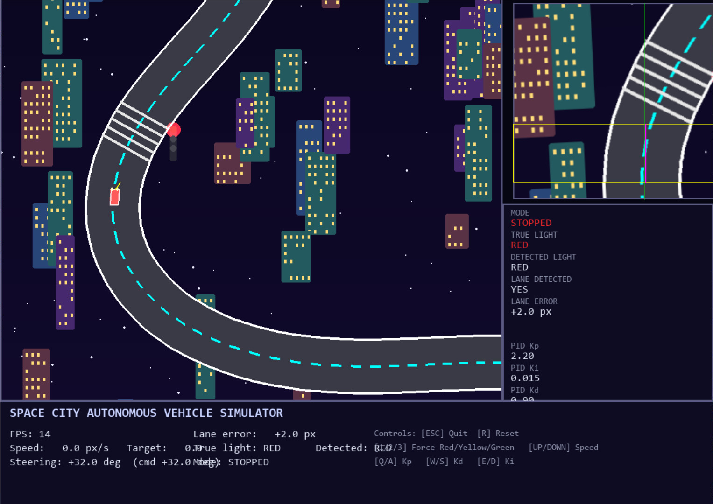

<div align="center">

# Autonomous Lane-Keeping Simulator

**A complete autonomous-driving pipeline — perception, planning, control, and dynamics — wired as an explicit ROS 2-style node/topic graph, running entirely in Pygame, NumPy, and OpenCV.**


━━━━━━━━━━━━━━━━━━━━ ✦ ━━━━━━━━━━━━━━━━━━━━

</div>

## 🟣 At a Glance

- **Explicit node/topic graph** — perception, planning, control, and dynamics communicate over named topics via a lightweight pub/sub bus, mirroring what a ROS 2 `rqt_graph` would show
- **Classical CV perception** — color-threshold lane detection and traffic-light classification run against a real forward-facing camera image, not simulated ground truth
- **Physically grounded camera model** — forward view built with an OpenCV affine warp of the top-down world, not a scripted perspective
- **Kinematic bicycle (Ackermann) model** — rate-limited steering actuator, separate accel/brake limits
- **Tunable PID lane-keeping controller** — anti-windup, low-pass filtered derivative, live in-sim gain tuning
- **Rule-based intersection planner** — reacts to detected (not ground-truth) traffic-light state

<br/>

## 🟣 Overview

Simulates a full self-driving stack on a closed test track with two signalled intersections: a world model generates ground truth, a simulated camera captures a forward view, a classical CV pipeline extracts lane position and traffic-light state from that image, a planner sets a target speed, a PID controller computes steering, and a bicycle-model vehicle integrates the result — one graph tick per frame.

Built as a drop-in substitute for a ROS 2 + Gazebo stack in an environment where a full simulator wasn't available, while preserving the same node boundaries, topics, and separation of concerns a ROS 2 implementation would have.

<br/>

<div align="center"></div>

<br/>

<div align="center">━━━━━━━━━━━━━━ ✦ ✧ ✦ ━━━━━━━━━━━━━━</div>

<br/>

## 🟣 Node / Topic Graph

| Node | Subscribes | Publishes |
|---|---|---|
| `world_node` | — | `/world/traffic_light_state` |
| `camera_node` | `/vehicle/state` | `/camera/image_raw` |
| `lane_detector_node` | `/camera/image_raw` | `/perception/lane_error`, `/perception/lane_detected` |
| `traffic_light_detector_node` | `/camera/image_raw` | `/perception/traffic_light_state` |
| `planner_node` | `/perception/traffic_light_state`, `/vehicle/state` | `/planner/target_speed`, `/planner/mode` |
| `pid_controller_node` | `/perception/lane_error` | `/control/steering_cmd` |
| `vehicle_node` | `/control/steering_cmd`, `/planner/target_speed` | `/vehicle/state` |

The bus (`src/core/bus.py`) is a synchronous stand-in for ROS 2 DDS transport — there's no executor or threading, since the pygame main loop is the single "spin" — but node boundaries and topic names match a real ROS 2 graph, so the wiring in `src/core/nodes.py` maps directly onto `rclpy` nodes if ported.

<br/>

## 🟣 Engineering Highlights

- **Lane detection** thresholds a fixed image band for lane-boundary white and center-line cyan pixels, falling back to the last known center when neither is detected — avoids discontinuous steering on momentary detection loss
- **Traffic-light detection** classifies by pixel-count majority across red/yellow/green RGB masks in the upper camera ROI, with a minimum-count floor to report "none" rather than force a false positive
- **PID controller** uses clamped integral anti-windup plus a saturation-aware second safeguard (stops integrating further in the saturating direction), and a low-pass filtered derivative term to prevent steering chatter from noisy lane-error input
- **Bicycle-model vehicle** rate-limits the steering actuator (`STEER_RATE`) and separates accel/brake limits, so heading changes smoothly rather than snapping
- **Planner** only acts on *detected* traffic-light state, not ground truth — detection latency and errors propagate through the whole pipeline, same as a real stack

<br/>

## 🟣 Tech Stack

| Layer | Tools |
|---|---|
| Simulation / rendering | Pygame |
| Perception | OpenCV (color thresholding, affine warp), NumPy |
| Control | Custom PID implementation |
| Dynamics | Kinematic bicycle (Ackermann) model |
| Architecture | Custom synchronous pub/sub bus (ROS 2-analogue node graph) |

<br/>

## 🟣 Project Structure
```
src/
├── main.py # Entry point, main loop, rendering orchestration
├── config.py # All tunable constants (dims, colors, gains, limits)
├── core/
│ ├── bus.py # Pub/sub message bus
│ └── nodes.py # Node graph wiring (topics <-> components)
├── world/
│ ├── track.py # Closed parametric track geometry
│ ├── scene.py # Static scene rendering (cached)
│ └── traffic_light.py # Ground-truth traffic-light state machine
├── sensing/
│ └── camera.py # Forward-camera affine warp
├── perception/
│ ├── lane_detector.py # Color-threshold lane detection
│ └── traffic_light_detector.py # Color-threshold light classification
├── planning/
│ └── planner.py # Target speed / mode decision logic
├── control/
│ └── pid.py # PID controller
├── dynamics/
│ └── vehicle.py # Bicycle-model vehicle dynamics
└── rendering/
├── draw.py # Dynamic overlay rendering (vehicle, lights)
└── hud.py # Telemetry HUD helpers
```


<br/>

## 🟣 Getting Started

```bash
git clone https://github.com/ktariqq/autonomous-lane-keeping-sim.git
cd autonomous-lane-keeping-sim
pip install -r requirements.txt

python -m src.main
```

<br/>

## 🟣 Controls

| Key | Action |
|---|---|
| `ESC` | Quit |
| `R` | Reset vehicle |
| `1` / `2` / `3` | Force traffic light to RED / YELLOW / GREEN |
| `↑` / `↓` | Increase / decrease cruise speed |
| `Q` / `A` | Increase / decrease PID `Kp` |
| `W` / `S` | Increase / decrease PID `Kd` |
| `E` / `D` | Increase / decrease PID `Ki` |

<br/>

## 🟣 Configuration

All tunable parameters — track geometry, vehicle limits, PID defaults, stop distance — live in `src/config.py`.

<br/>
<br/>
